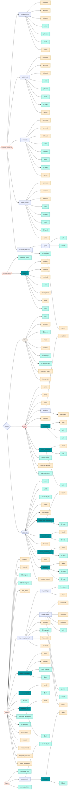

```mermaid

flowchart LR

    classDef tab fill:#fee9e5,stroke:#E4794A
    classDef main fill:#fddede,stroke:#e1000f
    classDef hidden fill:#f3ede5,stroke:#AEA397

    classDef node fill:#e9edfe,stroke:#465F9D
    classDef uri fill:#bafaee,stroke:#009081
    classDef nodeOrUri fill:#009099,stroke:#c7f6fc
    classDef literal fill:#feebd0,stroke:#C3992A

    dataset{dataset}-->hidden([hidden]):::hidden
    dataset-->main([main]):::main
    dataset-->resources([resources]):::resources
        main-->name1[name1]:::literal
        hidden-->uri1[uri1]:::uri
        hidden-->identifier1[identifier1]:::literal
        main-->title1[title1]:::literal
        main-->notes1[notes1]:::literal
        main-->temporal1[temporal1]:::node
            temporal1-->end_date1[end_date1]:::literal
            temporal1-->start_date1[start_date1]:::literal
        main-->modified1[modified1]:::literal
        tab1([Détails]):::tab-->created1[created1]:::literal
        tab1-->issued1[issued1]:::literal
        tab2([Contacts et acteurs]):::tab-->contact_point1[contact_point1]:::node
            contact_point1-->comment1[comment1]:::literal
            contact_point1-->acronym1[acronym1]:::literal
            contact_point1-->affiliation1[affiliation1]:::literal
            contact_point1-->url1[url1]:::uri
            contact_point1-->phone1[phone1]:::uri
            contact_point1-->email1[email1]:::uri
            contact_point1-->name2[name2]:::literal
        tab2-->publisher1[publisher1]:::node
            publisher1-->comment2[comment2]:::literal
            publisher1-->acronym2[acronym2]:::literal
            publisher1-->affiliation2[affiliation2]:::literal
            publisher1-->url2[url2]:::uri
            publisher1-->phone2[phone2]:::uri
            publisher1-->email2[email2]:::uri
            publisher1-->type1[fa:fa-list type1]:::uri
            publisher1-->name3[name3]:::literal
        tab2-->creator1[creator1]:::node
            creator1-->comment3[comment3]:::literal
            creator1-->acronym3[acronym3]:::literal
            creator1-->affiliation3[affiliation3]:::literal
            creator1-->url3[url3]:::uri
            creator1-->phone3[phone3]:::uri
            creator1-->email3[email3]:::uri
            creator1-->type2[fa:fa-list type2]:::uri
            creator1-->name4[name4]:::literal
        tab2-->rights_holder1[rights_holder1]:::node
            rights_holder1-->comment4[comment4]:::literal
            rights_holder1-->acronym4[acronym4]:::literal
            rights_holder1-->affiliation4[affiliation4]:::literal
            rights_holder1-->url4[url4]:::uri
            rights_holder1-->phone4[phone4]:::uri
            rights_holder1-->email4[email4]:::uri
            rights_holder1-->type3[fa:fa-list type3]:::uri
            rights_holder1-->name5[name5]:::literal
        tab2-->qualified_attribution1[qualified_attribution1]:::node
            qualified_attribution1-->agent1[agent1]:::node
                agent1-->url5[url5]:::uri
                agent1-->email5[email5]:::uri
                agent1-->name6[name6]:::literal
            qualified_attribution1-->had_role1[fa:fa-list had_role1]:::uri
        main-->in_series1[in_series1]:::nodeOrUri
            in_series1-->title2[title2]:::literal
            in_series1-->url6[url6]:::uri
            in_series1-->uri2[uri2]:::uri
        main-->series_member1[series_member1]:::nodeOrUri
            series_member1-->title3[title3]:::literal
            series_member1-->url7[url7]:::uri
            series_member1-->uri3[uri3]:::uri
        main-->landing_page1[landing_page1]:::uri
        tab3([Documentation]):::tab-->attributes_page1[attributes_page1]:::uri
        tab3-->page1[page1]:::nodeOrUri
            page1-->issued2[issued2]:::literal
            page1-->created2[created2]:::literal
            page1-->modified2[modified2]:::literal
            page1-->url8[url8]:::uri
            page1-->description1[description1]:::literal
            page1-->title4[title4]:::literal
            page1-->uri4[uri4]:::uri
        tab1-->category1[fa:fa-list category1]:::uri
        tab1-->subcategory1[fa:fa-list subcategory1]:::uri
        hidden-->theme1[fa:fa-list theme1]:::uri
        tab1-->free_tags1[free_tags1]:::literal
        tab1-->is_primary_topic_of1[is_primary_topic_of1]:::node
            is_primary_topic_of1-->in_catalog1[in_catalog1]:::node
                in_catalog1-->homepage1[homepage1]:::uri
                in_catalog1-->title5[title5]:::literal
            is_primary_topic_of1-->contact_point2[contact_point2]:::node
                contact_point2-->comment5[comment5]:::literal
                contact_point2-->acronym5[acronym5]:::literal
                contact_point2-->affiliation5[affiliation5]:::literal
                contact_point2-->url9[url9]:::uri
                contact_point2-->phone5[phone5]:::uri
                contact_point2-->email6[email6]:::uri
                contact_point2-->name7[name7]:::literal
            is_primary_topic_of1-->identifier2[identifier2]:::literal
            is_primary_topic_of1-->language1[fa:fa-list language1]:::uri
            is_primary_topic_of1-->harvested1[harvested1]:::literal
            is_primary_topic_of1-->modified3[modified3]:::literal
        hidden-->bbox1[bbox1]:::literal
        tab1-->spatial_coverage1[spatial_coverage1]:::nodeOrUri
            spatial_coverage1-->label1[label1]:::literal
            spatial_coverage1-->identifier3[identifier3]:::literal
            spatial_coverage1-->in_scheme1[fa:fa-list in_scheme1]:::uri
            spatial_coverage1-->uri5[fa:fa-list uri5]:::uri
        hidden-->spatial1[spatial1]:::literal
        hidden-->territory1[fa:fa-list territory1]:::uri
        hidden-->territory_full1[fa:fa-list territory_full1]:::uri
        tab1-->access_rights1[access_rights1]:::nodeOrUri
            access_rights1-->label2[label2]:::literal
            access_rights1-->uri6[fa:fa-list uri6]:::uri
        main-->restricted_access1[restricted_access1]:::literal
        tab1-->crs1[fa:fa-list crs1]:::uri
        tab1-->conforms_to1[conforms_to1]:::nodeOrUri
            conforms_to1-->title6[title6]:::literal
            conforms_to1-->uri7[fa:fa-list uri7]:::uri
        tab1-->accrual_periodicity1[fa:fa-list accrual_periodicity1]:::uri
        tab1-->language2[fa:fa-list language2]:::uri
        tab1-->provenance1[provenance1]:::literal
        tab1-->version1[version1]:::literal
        tab1-->version_notes1[version_notes1]:::literal
        tab1-->temporal_resolution1[temporal_resolution1]:::literal
        tab1-->spatial_resolution1[spatial_resolution1]:::literal
        hidden-->equivalent_scale1[equivalent_scale1]:::literal
        hidden-->license_id1[license_id1]:::literal
        main-->graphic_preview1[graphic_preview1]:::uri
        tab4([Export]):::tab-->as_inspire_xml1[as_inspire_xml1]:::uri
        tab4-->as_dcat_rdf1[as_dcat_rdf1]:::node
            as_dcat_rdf1-->download_url1[download_url1]:::uri
            as_dcat_rdf1-->format1[format1]:::nodeOrUri
                format1-->label3[label3]:::literal
                format1-->uri8[fa:fa-list uri8]:::uri
        tab4-->ckan_api_show1[ckan_api_show1]:::uri
        resources-->uri9[uri9]:::uri
        resources-->url10[url10]:::uri
        resources-->download_url2[download_url2]:::uri
        resources-->name8[name8]:::literal
        resources-->description2[description2]:::literal
        resources-->media_type_ressource1[media_type_ressource1]:::nodeOrUri
            media_type_ressource1-->label4[label4]:::literal
            media_type_ressource1-->uri10[fa:fa-list uri10]:::uri
        resources-->other_format1[other_format1]:::nodeOrUri
            other_format1-->label5[label5]:::literal
            other_format1-->uri11[fa:fa-list uri11]:::uri
        resources-->format2[format2]:::literal
        resources-->service_conforms_to1[service_conforms_to1]:::nodeOrUri
            service_conforms_to1-->title7[title7]:::literal
            service_conforms_to1-->uri12[fa:fa-list uri12]:::uri
        resources-->rights1[rights1]:::literal
        resources-->licenses1[licenses1]:::nodeOrUri
            licenses1-->label6[label6]:::literal
            licenses1-->type4[fa:fa-list type4]:::uri
            licenses1-->uri13[fa:fa-list uri13]:::uri
        resources-->resource_issued1[resource_issued1]:::literal

```
