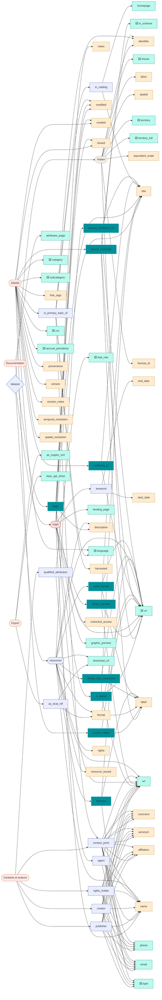

```mermaid

flowchart LR

    classDef tab fill:#fee9e5,stroke:#E4794A
    classDef main fill:#fddede,stroke:#e1000f
    classDef hidden fill:#f3ede5,stroke:#AEA397

    classDef node fill:#e9edfe,stroke:#465F9D
    classDef uri fill:#bafaee,stroke:#009081
    classDef nodeOrUri fill:#009099,stroke:#c7f6fc
    classDef literal fill:#feebd0,stroke:#C3992A

    dataset{dataset}-->hidden([hidden]):::hidden
    dataset-->main([main]):::main
    dataset-->resources([resources]):::resources
        main-->name[name]:::literal
        hidden-->uri[uri]:::uri
        hidden-->identifier[identifier]:::literal
        main-->title[title]:::literal
        main-->notes[notes]:::literal
        main-->temporal[temporal]:::node
            temporal-->end_date[end_date]:::literal
            temporal-->start_date[start_date]:::literal
        main-->modified[modified]:::literal
        tab1([Détails]):::tab-->created[created]:::literal
        tab1-->issued[issued]:::literal
        tab2([Contacts et acteurs]):::tab-->contact_point[contact_point]:::node
            contact_point-->comment[comment]:::literal
            contact_point-->acronym[acronym]:::literal
            contact_point-->affiliation[affiliation]:::literal
            contact_point-->url[url]:::uri
            contact_point-->phone[phone]:::uri
            contact_point-->email[email]:::uri
            contact_point-->name[name]:::literal
        tab2-->publisher[publisher]:::node
            publisher-->comment[comment]:::literal
            publisher-->acronym[acronym]:::literal
            publisher-->affiliation[affiliation]:::literal
            publisher-->url[url]:::uri
            publisher-->phone[phone]:::uri
            publisher-->email[email]:::uri
            publisher-->type[fa:fa-list type]:::uri
            publisher-->name[name]:::literal
        tab2-->creator[creator]:::node
            creator-->comment[comment]:::literal
            creator-->acronym[acronym]:::literal
            creator-->affiliation[affiliation]:::literal
            creator-->url[url]:::uri
            creator-->phone[phone]:::uri
            creator-->email[email]:::uri
            creator-->type[fa:fa-list type]:::uri
            creator-->name[name]:::literal
        tab2-->rights_holder[rights_holder]:::node
            rights_holder-->comment[comment]:::literal
            rights_holder-->acronym[acronym]:::literal
            rights_holder-->affiliation[affiliation]:::literal
            rights_holder-->url[url]:::uri
            rights_holder-->phone[phone]:::uri
            rights_holder-->email[email]:::uri
            rights_holder-->type[fa:fa-list type]:::uri
            rights_holder-->name[name]:::literal
        tab2-->qualified_attribution[qualified_attribution]:::node
            qualified_attribution-->agent[agent]:::node
                agent-->url[url]:::uri
                agent-->email[email]:::uri
                agent-->name[name]:::literal
            qualified_attribution-->had_role[fa:fa-list had_role]:::uri
        main-->in_series[in_series]:::nodeOrUri
            in_series-->title[title]:::literal
            in_series-->url[url]:::uri
            in_series-->uri[uri]:::uri
        main-->series_member[series_member]:::nodeOrUri
            series_member-->title[title]:::literal
            series_member-->url[url]:::uri
            series_member-->uri[uri]:::uri
        main-->landing_page[landing_page]:::uri
        tab3([Documentation]):::tab-->attributes_page[attributes_page]:::uri
        tab3-->page[page]:::nodeOrUri
            page-->issued[issued]:::literal
            page-->created[created]:::literal
            page-->modified[modified]:::literal
            page-->url[url]:::uri
            page-->description[description]:::literal
            page-->title[title]:::literal
            page-->uri[uri]:::uri
        tab1-->category[fa:fa-list category]:::uri
        tab1-->subcategory[fa:fa-list subcategory]:::uri
        hidden-->theme[fa:fa-list theme]:::uri
        tab1-->free_tags[free_tags]:::literal
        tab1-->is_primary_topic_of[is_primary_topic_of]:::node
            is_primary_topic_of-->in_catalog[in_catalog]:::node
                in_catalog-->homepage[homepage]:::uri
                in_catalog-->title[title]:::literal
            is_primary_topic_of-->contact_point[contact_point]:::node
                contact_point-->comment[comment]:::literal
                contact_point-->acronym[acronym]:::literal
                contact_point-->affiliation[affiliation]:::literal
                contact_point-->url[url]:::uri
                contact_point-->phone[phone]:::uri
                contact_point-->email[email]:::uri
                contact_point-->name[name]:::literal
            is_primary_topic_of-->identifier[identifier]:::literal
            is_primary_topic_of-->language[fa:fa-list language]:::uri
            is_primary_topic_of-->harvested[harvested]:::literal
            is_primary_topic_of-->modified[modified]:::literal
        hidden-->bbox[bbox]:::literal
        tab1-->spatial_coverage[spatial_coverage]:::nodeOrUri
            spatial_coverage-->label[label]:::literal
            spatial_coverage-->identifier[identifier]:::literal
            spatial_coverage-->in_scheme[fa:fa-list in_scheme]:::uri
            spatial_coverage-->uri[fa:fa-list uri]:::uri
        hidden-->spatial[spatial]:::literal
        hidden-->territory[fa:fa-list territory]:::uri
        hidden-->territory_full[fa:fa-list territory_full]:::uri
        tab1-->access_rights[access_rights]:::nodeOrUri
            access_rights-->label[label]:::literal
            access_rights-->uri[fa:fa-list uri]:::uri
        main-->restricted_access[restricted_access]:::literal
        tab1-->crs[fa:fa-list crs]:::uri
        tab1-->conforms_to[conforms_to]:::nodeOrUri
            conforms_to-->title[title]:::literal
            conforms_to-->uri[fa:fa-list uri]:::uri
        tab1-->accrual_periodicity[fa:fa-list accrual_periodicity]:::uri
        tab1-->language[fa:fa-list language]:::uri
        tab1-->provenance[provenance]:::literal
        tab1-->version[version]:::literal
        tab1-->version_notes[version_notes]:::literal
        tab1-->temporal_resolution[temporal_resolution]:::literal
        tab1-->spatial_resolution[spatial_resolution]:::literal
        hidden-->equivalent_scale[equivalent_scale]:::literal
        hidden-->license_id[license_id]:::literal
        main-->graphic_preview[graphic_preview]:::uri
        tab4([Export]):::tab-->as_inspire_xml[as_inspire_xml]:::uri
        tab4-->as_dcat_rdf[as_dcat_rdf]:::node
            as_dcat_rdf-->download_url[download_url]:::uri
            as_dcat_rdf-->format[format]:::nodeOrUri
                format-->label[label]:::literal
                format-->uri[fa:fa-list uri]:::uri
        tab4-->ckan_api_show[ckan_api_show]:::uri
        resources-->uri[uri]:::uri
        resources-->url[url]:::uri
        resources-->download_url[download_url]:::uri
        resources-->name[name]:::literal
        resources-->description[description]:::literal
        resources-->media_type_ressource[media_type_ressource]:::nodeOrUri
            media_type_ressource-->label[label]:::literal
            media_type_ressource-->uri[fa:fa-list uri]:::uri
        resources-->other_format[other_format]:::nodeOrUri
            other_format-->label[label]:::literal
            other_format-->uri[fa:fa-list uri]:::uri
        resources-->format[format]:::literal
        resources-->service_conforms_to[service_conforms_to]:::nodeOrUri
            service_conforms_to-->title[title]:::literal
            service_conforms_to-->uri[fa:fa-list uri]:::uri
        resources-->rights[rights]:::literal
        resources-->licenses[licenses]:::nodeOrUri
            licenses-->label[label]:::literal
            licenses-->type[fa:fa-list type]:::uri
            licenses-->uri[fa:fa-list uri]:::uri
        resources-->resource_issued[resource_issued]:::literal

```
